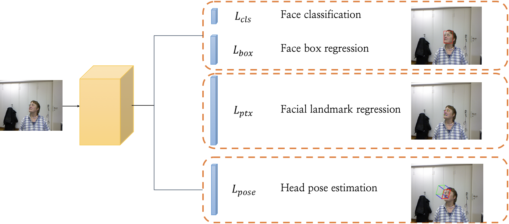

# Head Pose Estimation

Implementation of head pose estimation using face images.


## Data

- BIWI

- AFLW2000

- 300W_LP

- Synthesized face image wearing a mask.

## Model



## Result

|Dataset|YAW|PITCH|ROLL|MAE|
|------|---|---|---|---|
|BIWI|5.43|4.17|3.74|4.45|
|BIWI_masked|4.45|2.97|2.90|3.44|
|AFLW2000|23.82|12.70|13.95|16.82|
|AFLW2000_masked|20.24|13.08|10.22|14.51|

300W_LP is used for training.

## Getting started
- Evalution
```
python test.py 
```

- Train
```
python train.py
```

## Demo


